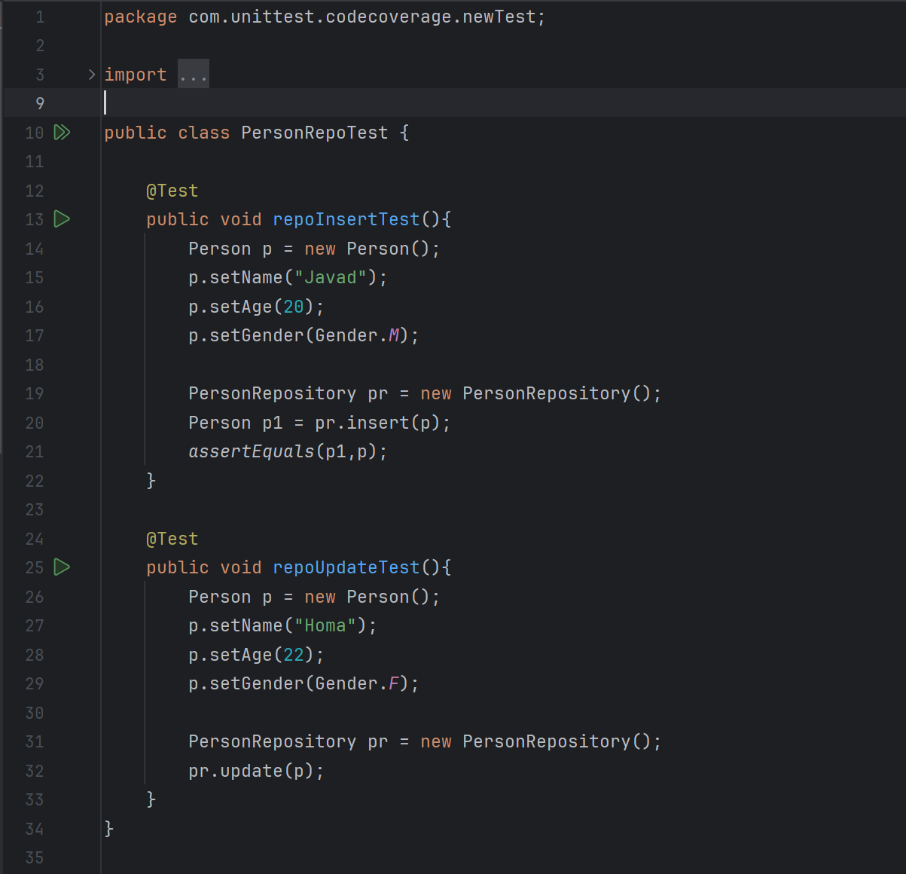
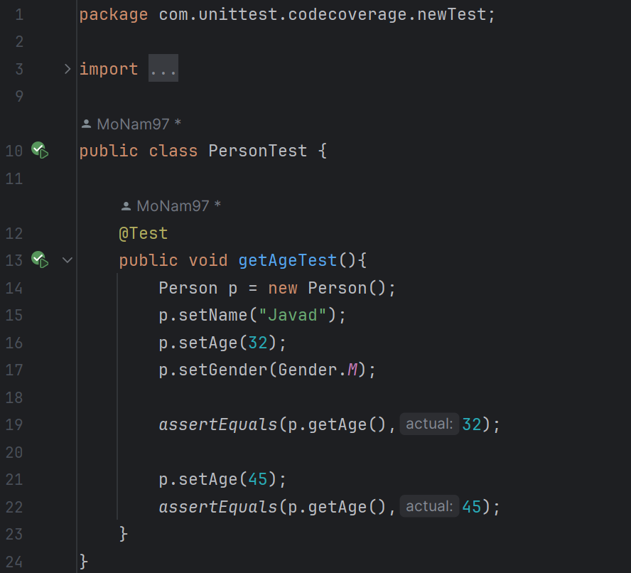
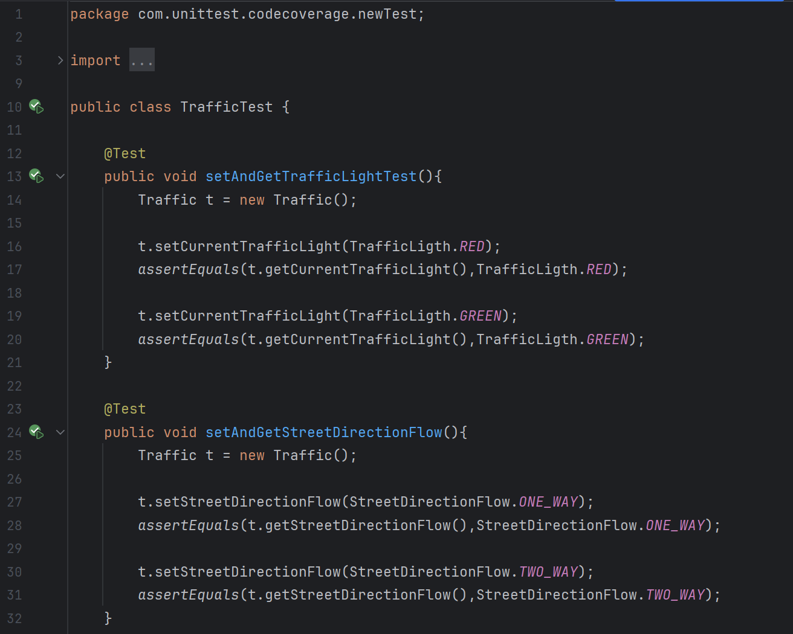
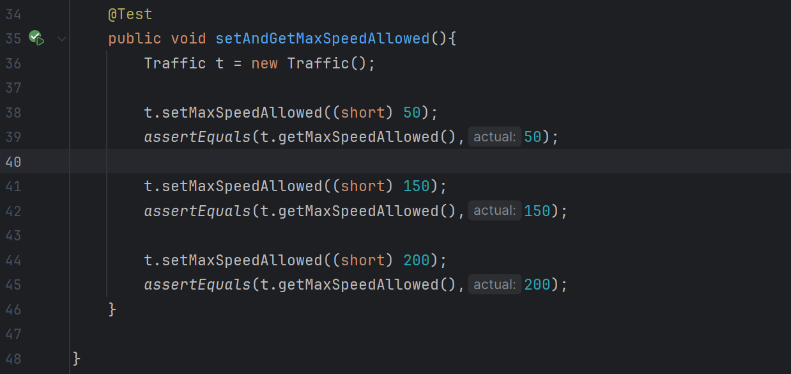
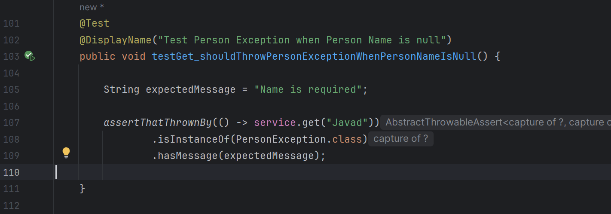

# گزارش آزمایش هفتم

محمد نامدار  ـــــ  حمیدرضا دهباشی

آدرس مخزن پروژه: https://github.com/hamiddeboo8/Test-Coverage

## گزارش پروژه

### افزایش پوشش آزمون کلاس PersonRepository

کلاس جدید PersonRepoTest
 را در پوشه newTest
ایجاد می کنیم که شامل دو تابع تست repoInsertTest و repoUpdateTest
هستند که به ترتیب متد های insert و update کلاس مربوطه را تست می کنند.

[commit 696af0699b5f83dde135b0a6fadd7f9d885c15bb](https://github.com/hamiddeboo8/Test-Coverage/commit/696af0699b5f83dde135b0a6fadd7f9d885c15bb)

همچنین برای delete نیز تست نوشته شد تا میزان پوشش دهی PersonRepository افزایش یابد.
[commit 4c38cafe059d6cf8ad69b4ea2d2aaaca3ba73ae9](https://github.com/hamiddeboo8/Test-Coverage/commit/4c38cafe059d6cf8ad69b4ea2d2aaaca3ba73ae9)

### افزایش پوشش آزمون کلاس Person

کلاس جدید PersonTest
 را در پوشه newTest
ایجاد می کنیم که شامل تابع getAgeTest
است که متد getAge کلاس مربوطه را تست می کند.

[commit 844a4339971d98a21e6a1b102d8edd79b5c3361b](https://github.com/hamiddeboo8/Test-Coverage/commit/844a4339971d98a21e6a1b102d8edd79b5c3361b)

### افزایش پوشش آزمون کلاس Traffic

کلاس جدید TrafficTest
را در پوشه newTest
ایجاد می کنیم که شامل توابع setAndGetTrafficLightTest و setAndGetStreetDirectionFlow و setAndGetMaxSpeedAllowed
است که به ترتیب متد های setCurrentTrafficLight و getCurrentTrafficLight
،
setStreetDirectionFlow و getStreetDirectionFlow
و نهایتا setMaxSpeedAllowed و getMaxSpeedAllowed را از کلاس Traffic
تست می کنند.

[commit 98e0a87e9e52758b94df9b4e4f33f2ab075c97d5](https://github.com/hamiddeboo8/Test-Coverage/commit/98e0a87e9e52758b94df9b4e4f33f2ab075c97d5)

<b> توجه: </b>
عنوان کامیت باید به صورت 
improve Traffic test coverage + add StreetDirectionFlow test
اصلاح شود.

### افزایش پوشش آزمون کلاس StreetDirectionFlow

در همان کلاس TrafficTest
، در متد setAndGetStreetDirectionFlow
نمونه هایی از این کلاس تولید و در نتیجه آن را تست می کنیم.

[commit 98e0a87e9e52758b94df9b4e4f33f2ab075c97d5](https://github.com/hamiddeboo8/Test-Coverage/commit/98e0a87e9e52758b94df9b4e4f33f2ab075c97d5)

<i><u>
تصاویر قسمت قبل
</u></i>

### افزایش پوشش آزمون کلاس PersonServiceImpl

برای این کلاس با اضافه کردن تابع
testGet_shouldThrowPersonExceptionWhenPersonNameIsNull
، که متد get کلاس PersonServiceImpl را تست می کند،
به کلاس از پیش تعریف شده PersonServiceTest
پوشش آزمون را برای این کلاس بهبود می دهیم.

[commit c3d8bf8ba854100b61ff2a09e2f238732818f618](https://github.com/hamiddeboo8/Test-Coverage/commit/c3d8bf8ba854100b61ff2a09e2f238732818f618)

همچنین دو تابع زیر مربوط به بررسی تابع delete در این کلاس اضافه شدند.
[commit 5c234ecd6ea53968c37a6da8116dbb6818483529](https://github.com/hamiddeboo8/Test-Coverage/commit/5c234ecd6ea53968c37a6da8116dbb6818483529)

### افزایش پوشش آزمون کلاس PersonValidator

با اضافه کردن تابع قسمت قبل (PersonServiceImpl)
، در مسیر اجرا آن متد requiredName از کلاس PersonValidator 
نیز صدا زده می شود که باعث افزایش پوشش آزمون برای این کلاس می شود.

[commit c3d8bf8ba854100b61ff2a09e2f238732818f618](https://github.com/hamiddeboo8/Test-Coverage/commit/c3d8bf8ba854100b61ff2a09e2f238732818f618)

### افزایش پوشش آزمون کلاس FootPassenger

در این قسمت تابع زیر جهت تست crossedCrosswalk پیاده سازی شده است. برای این قسمت از آن جا که استفاده ای در سرویس های دیگر نداشت، یک سرویس نیز برای آن نوشته شد که مسئول این است اگر شخص مورد نظر از خیابان عبور کرده بود اما از خطوط عابرپیاده عبور نکرده بود خطای لازم را نمایش دهد.

[commit 4565672f3ed95d609d79a733b49c1409efcf3f84](https://github.com/hamiddeboo8/Test-Coverage/commit/4565672f3ed95d609d79a733b49c1409efcf3f84)

<i><u>
تصاویر قسمت قبل
</u></i>

### افزایش پوشش آزمون کلاس PersonException

در جریان اجرا تابع get از کلاس PersonServiceImpl
ورودی طوری تعیین شده تا وارد if شده
و سازنده
`public PersonException(String msg)`
از کلاس PersonException صدا زده بشود
که موجب افزایش پوشش آزمون برای این کلاس می شود.

[commit c3d8bf8ba854100b61ff2a09e2f238732818f618](https://github.com/hamiddeboo8/Test-Coverage/commit/c3d8bf8ba854100b61ff2a09e2f238732818f618)

<i><u>
تصاویر قسمت PersonServiceImpl
</u></i>

## مقایسه پوشش آزمون در ابتدا با پایان کار

این رو وقتی قسمت خودت رو زدی بهم بگو کامل کنم

